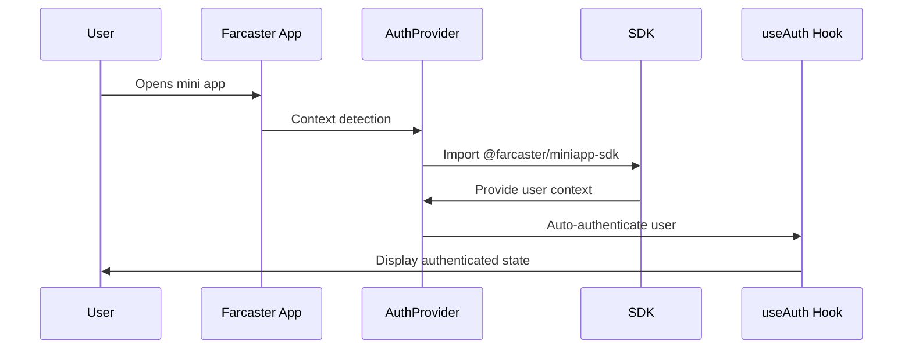
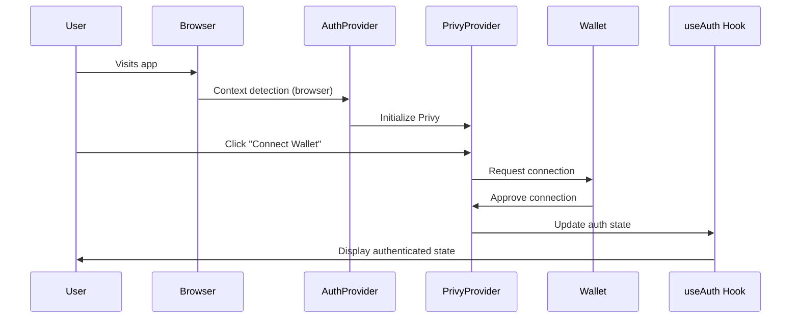

# Authentication Architecture

## Overview

Multi-context authentication system supporting dual environments: Farcaster mini apps and browser-based wallet authentication. Built with strict client-server separation and modular provider architecture.

## Core Principles

### 1. Context-Aware Authentication
- **Automatic Detection**: System detects Farcaster vs browser context without user intervention
- **Provider Isolation**: Each context uses dedicated authentication providers
- **Graceful Fallback**: Robust error handling with safe defaults

### 2. Modular Provider System
- **Separation of Concerns**: Each provider handles single authentication method
- **Clean Interfaces**: Consistent API across all providers
- **Dynamic Loading**: Providers loaded only when needed

### 3. Client-Server Separation
```
Client Hooks → API Routes → Services → External APIs
```
- **No Direct Imports**: Client never directly imports server-side services
- **API Gateway Pattern**: All external service calls go through `/api/*` routes
- **Type Safety**: Shared types ensure consistency across boundaries

## Architecture Components

### Context Detection Layer
```typescript
// lib/auth/resolvers/ContextDetector.ts
class ContextDetector {
  static async detect(): Promise<AuthContext>
}
```

**Responsibilities:**
- Detect execution environment (Farcaster miniapp vs browser)
- Provide consistent context identification
- Handle edge cases and timing issues

**Detection Strategy:**
1. **Primary**: SDK-based detection via `@farcaster/miniapp-sdk`
2. **Fallback**: Heuristic analysis (iframe, referrer, URL params)
3. **Default**: Safe fallback to browser context

### Provider Layer
```typescript
// Provider hierarchy
AuthProvider           // Context-aware provider selector
├── FarcasterProvider  // Farcaster miniapp authentication  
├── PrivyProvider      // Browser wallet authentication
└── DevAuthProvider    // Development mode override
```

**Provider Selection Logic:**
```typescript
if (context === "farcaster_miniapp") return <FarcasterProvider>
if (context === "browser" && hasPrivyId) return <PrivyProvider>
return <>{children}</> // Fallback: no authentication
```

### Hook Layer
```typescript
// hooks/auth/useAuth.ts
interface AuthState {
  isAuthenticated: boolean;
  user: User | null;
  provider: AuthProvider | null;
  context: AuthContext;
  loading: boolean;
  error: string | null;
}
```

**Hook Responsibilities:**
- Aggregate authentication state from active provider
- Handle context-specific authentication logic
- Provide consistent interface to UI components

### Service Layer
```typescript
// app/services/PostHogService.ts
class PostHogService {
  static identifyUser(user: User, context: AuthContext): void
  static resetIdentity(context: AuthContext): void
}
```

**Service Responsibilities:**
- Handle user analytics and tracking
- Manage session state
- Integrate with external services

## Authentication Flows

### Farcaster Mini App Flow


**Key Features:**
- **Automatic Authentication**: No user interaction required
- **Rich Profile Data**: Real Farcaster user information
- **Seamless Experience**: Instant access to authenticated features

### Browser Wallet Flow


**Key Features:**
- **Manual Connection**: User initiates wallet connection
- **Multiple Wallets**: Support for various wallet providers
- **Persistent Sessions**: Maintains connection across browser sessions

## Type System

### Core Types
```typescript
// lib/types/auth.ts
export type AuthProvider = "privy" | "farcaster";
export type AuthContext = "browser" | "farcaster_miniapp";

export interface User {
  id: string;
  walletAddress?: string;      // Wallet authentication
  fid?: number;                // Farcaster ID
  fname?: string;              // Farcaster username
  displayName?: string;        // Display name
  pfpUrl?: string;             // Profile picture URL
  authProvider: AuthProvider;
}

export interface AuthState {
  isAuthenticated: boolean;
  user: User | null;
  provider: AuthProvider | null;
  context: AuthContext;
  loading: boolean;
  error: string | null;
}
```

### Provider-Specific Types
```typescript
// Farcaster-specific types
export interface FarcasterContextData {
  user: {
    fid: number;
    username?: string;
    displayName?: string;
    pfpUrl?: string;
    // ... additional profile fields
  } | null;
  location: unknown;
  miniApp: FarcasterMiniAppStatus;
}

// Mini app management types
export interface FarcasterMiniAppStatus {
  isAdded: boolean;
  notificationsEnabled: boolean;
  isLoading: boolean;
  error: string | null;
}
```

## Configuration Management

### Environment Configuration
```typescript
// lib/config/env.ts
export const env = {
  NEXT_PUBLIC_DEV_MODE: process.env.NEXT_PUBLIC_DEV_MODE === "true",
  NEXT_PUBLIC_PRIVY_APP_ID: process.env.NEXT_PUBLIC_PRIVY_APP_ID || "",
  // ... other environment variables
} as const;
```

### Feature Flags
```typescript
// lib/config/features.ts  
export const features = {
  ENABLE_FARCASTER_AUTH: true,
  ENABLE_WALLET_AUTH: true,
  ENABLE_DEV_AUTH: env.NEXT_PUBLIC_DEV_MODE,
} as const;
```

## Error Handling Strategy

### Graceful Degradation
```typescript
// Context detection failure → default to browser
// Provider initialization failure → show appropriate UI
// Authentication failure → clear error messaging
```

### Error Boundaries
- **Provider Level**: Each provider handles its own errors
- **Hook Level**: useAuth provides error state to UI
- **Component Level**: UI components show error states appropriately

### Logging Strategy
```typescript
// Keep essential error logging
console.error("Authentication failed:", error);

// Remove debug logging in production
// console.log("🎯 Debug info") ← Removed
```

## Development Features

### Development Mode Override
```typescript
// app/providers.tsx
{env.NEXT_PUBLIC_DEV_MODE ? (
  <DevAuthProvider>
    {children}
  </DevAuthProvider>
) : (
  children
)}
```

**Dev Mode Features:**
- **Mock Authentication**: Hardcoded user data for rapid development
- **Context Override**: Test both contexts without deployment
- **Debug Interface**: Additional controls for testing flows

### Testing Strategy
- **Unit Tests**: Individual provider functionality
- **Integration Tests**: Cross-provider interactions
- **E2E Tests**: Full authentication flows in both contexts

## Security Considerations

### Iframe Security
- **Farcaster Context**: Privy disabled to prevent iframe security issues
- **Browser Context**: Full wallet functionality available
- **Context Isolation**: Providers never overlap contexts

### Data Privacy
- **Minimal Data**: Only collect necessary user information
- **Client-Side**: Sensitive operations handled client-side when possible
- **Secure Storage**: Authentication tokens managed by providers

### Error Information
- **Limited Exposure**: Error messages don't leak sensitive information
- **Safe Defaults**: System defaults to least-privileged state on errors

## Performance Optimizations

### Dynamic Imports
```typescript
// Conditional loading reduces bundle size
const { sdk } = await import("@farcaster/miniapp-sdk");
const { useFarcaster } = require("@/lib/auth/providers/FarcasterProvider");
```

### Lazy Initialization
- **Context Detection**: Only runs when needed
- **Provider Loading**: Providers initialize only in appropriate contexts
- **SDK Loading**: Farcaster SDK loaded only in miniapp context

### Caching Strategy
- **Context Detection**: Results cached for session duration
- **User Data**: Profile information cached with appropriate TTL
- **Provider State**: Authentication state persisted across page loads

## File Structure

```
lib/auth/
├── providers/           # Authentication providers
│   ├── AuthProvider.tsx      # Context-aware provider selector
│   ├── FarcasterProvider.tsx # Farcaster miniapp authentication
│   ├── PrivyProvider.tsx     # Browser wallet authentication  
│   └── DevAuthProvider.tsx   # Development mode override
├── resolvers/          # Context detection and user resolution
│   ├── ContextDetector.ts    # Environment context detection
│   └── UserResolver.ts       # User data resolution
└── index.ts            # Public API exports

hooks/auth/
├── useAuth.ts          # Primary authentication hook
├── index.ts            # Hook exports

components/auth/
├── UnifiedAuthTest.tsx      # Authentication status component
├── WalletDisconnectionGuide.tsx # User education component
└── index.ts                 # Component exports

lib/types/
├── auth.ts             # Authentication type definitions
└── index.ts            # Type exports
```

## Migration and Extensibility

### Adding New Providers
1. Create provider component in `lib/auth/providers/`
2. Add provider type to `AuthProvider` union
3. Update `AuthProvider.tsx` context selection logic
4. Add provider-specific types to `lib/types/auth.ts`

### Context Extensions
1. Add new context to `AuthContext` type
2. Update `ContextDetector.ts` detection logic
3. Handle new context in provider selection
4. Add UI handling for new context

### Provider Interface
```typescript
interface AuthProviderInterface {
  user: User | null;
  isLoading: boolean;
  error: string | null;
  authenticate: (params?: any) => Promise<void>;
  logout: () => Promise<void>;
}
```

This architecture provides a robust, scalable foundation for authentication that can handle multiple contexts while maintaining clean separation of concerns and excellent developer experience. 